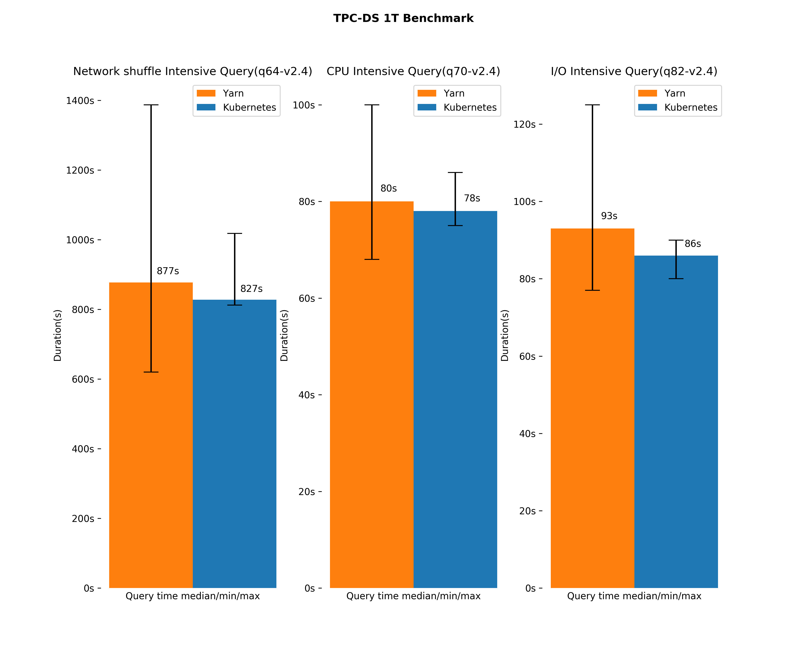

This repository contains benchmark results and best practice to run Spark workloads on EKS.

## Spark on Kubernetes

Kubernetes is a fast growing open-source platform which provides container-centric infrastructure. Kubernetes has first class support on Amazon Web Services and Amazon Elastic Kubernetes Service (Amazon EKS) is a fully managed Kubernetes service.

Traditionally, data processing workloads have been run in dedicated setups like the YARN/Hadoop stack. However, unifying the control plane for all workloads on Kubernetes simplifies cluster management and can improve resource utilization. Engineers across several companies and organizations have been working on Kubernetes resource manager support as a cluster scheduler backend within Spark.

Starting with Spark 2.3, users can run Spark workloads in an existing Kubernetes cluster and take advantage of Apache Spark’s ability to manage distributed data processing tasks.

In order to run large scale spark applications in Kubernetes, there's still a lots of performance issues in Spark 2.4 or 3.0 we'd like users to know. This repo will talk about these performance optimization and best practice moving Spark workloads to Kubernetes.

## Getting Started

To run TPC-DS benchmark on EKS cluster, please follow [instructions](./benchmark/README.md)

## Performance Hits and Optimizations

- [Kubernetes Cluster Optimization](./performance/kubernetes.md)

- [Shuffle Performance Improvement](./performance/shuffle.md)

- [S3A Committers](./performance/s3.md)

- [Customized Schedulers](./performance/scheduler.md)

## TPC-DS Benchmark

Created by a third-party committee, TPC-DS is the de-facto industry standard benchmark for measuring the performance of decision support solutions. According to its own homepage (https://www.tpc.org/tpcds/), it defines decision support systems as those that examine large volumes of data, give answers to real-world business questions, execute SQL queries of various operational requirements and complexities (e.g., ad-hoc, reporting, iterative OLAP, data mining), and are characterized by high CPU and IO load.

This benchmark includes 104 queries that exercise a large part of the SQL 2003 standards – 99 queries of the TPC-DS benchmark, four of which with two variants (14, 23, 24, 39) and “s_max” query performing a full scan and aggregation of the biggest table, store_sales.

We can evaluate and measure the performance of Spark SQL using the TPC-DS benchmark on Kubernetes (EKS) and Apache Yarn (EMR).

q64-v2.4, q70-v2.4, q82-v2.4 are very representative and typical. They are Network shuffle, CPU, I/O intensive queris. From the result, we can see performance on Kubernetes and Apache Yarn are very similar. kubernetes wins slightly on these three queries. In total, 10 iterations of the query have been performed and the median execution time is taken into consideration for comparison.

- Spark on Kubernetes fetch more blocks from local rather than remote. Executors fetch local blocks from file and remote blocks need to be fetch through network. Fetch blocks locally is much more efficient compare to remote fetching.

- Spark on Yarn seems take more time on JVM GC. Frequent GC will block executor process and have a big impact on the overall performance. We have not checked number of minor gc vs major gc, this need more investigation in the future.

- Spark on Kubernetes use more time on `shuffleFetchWaitTime` and `shuffleWriteTime`. Looks like executors on Kubernetes take more time to read and write shuffle data. Spark on Kubernetes in the benchmark use `hostPath` as spark scratch space. I think disk performance I/O is not a problem.

There're 68% of queries running faster on Kubernetes, 6% of queries has similar performance as Yarn.

In total, our benchmark results shows TPC-DS queries against 1T dataset take less time to finish, it save ~5% time compare to YARN based cluster.

## Credits and Thanks

- [@steveloughran](https://github.com/steveloughran) gives a lot of helps to use S3A staging and magic committers and understand zero-rename committer deeply.

- [@moomindani](https://github.com/moomindani) help on the current status of S3 support for spark in AWS.

- TPC-DS and TeraSort is pretty popular in big data area and there're few existing solutions. Some code snippets in the repo come from [@Kisimple](https://github.com/kisimple/spark/tree/terasort/examples/src/main/scala/org/apache/spark/examples/terasort) and [@cern](https://gitlab.cern.ch/db/spark-service/spark-k8s-examples).

## References

- [Valcano - A Kubernetes Native Batch System](https://github.com/volcano-sh/volcano)
- [Apache Spark usage and deployment models for scientific computing](https://www.epj-conferences.org/articles/epjconf/pdf/2019/19/epjconf_chep2018_07020.pdf)
- [Experience of Running Spark on Kubernetes on OpenStack for High Energy Physics Wrokloads](https://www.iteblog.com/sparksummit2018/experience-of-running-spark-on-kubernetes-on-openstack-for-high-energy-physics-workloads-with-prasanth-kothuri-piotr-mrowczynski-iteblog.pdf)