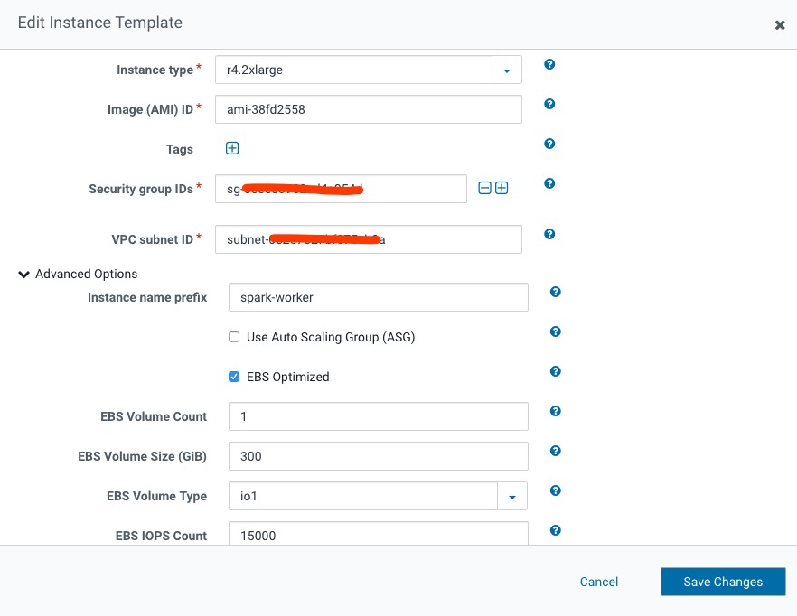
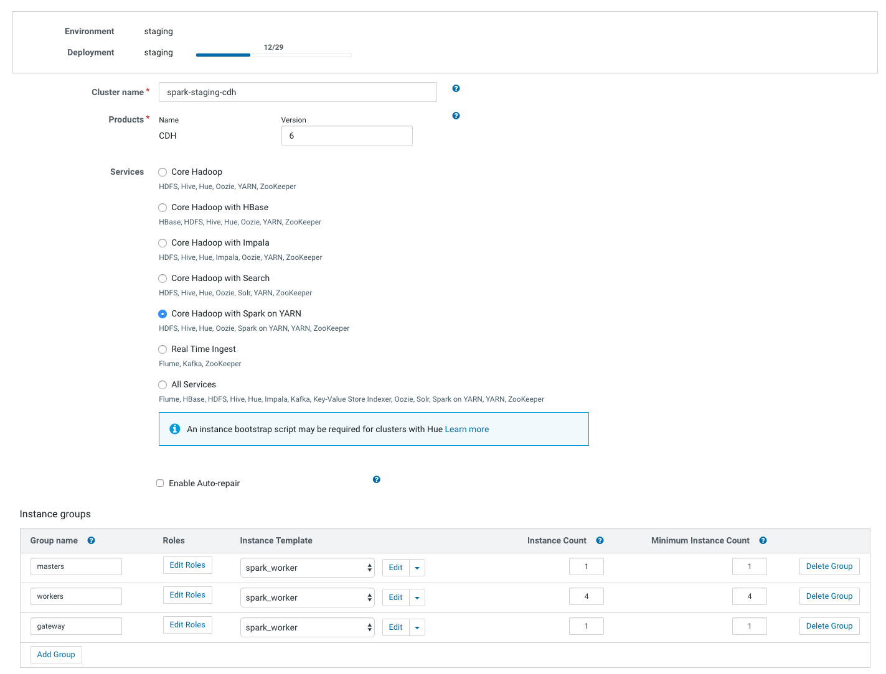
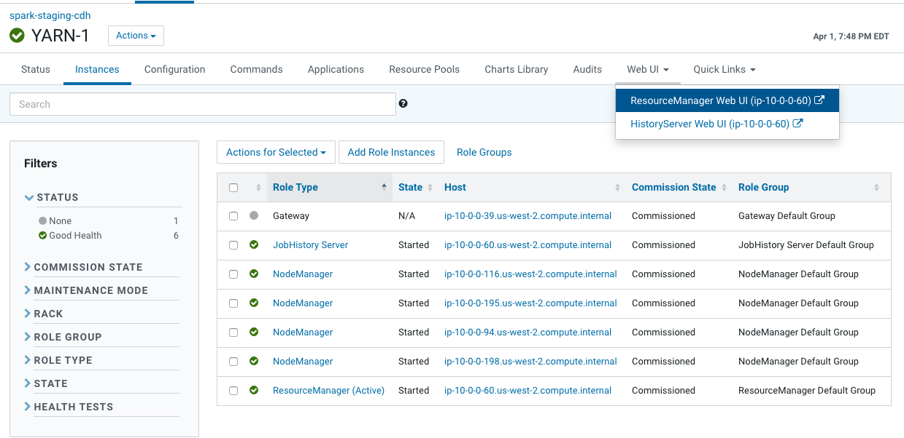
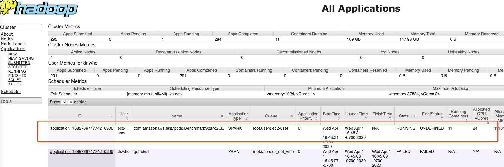
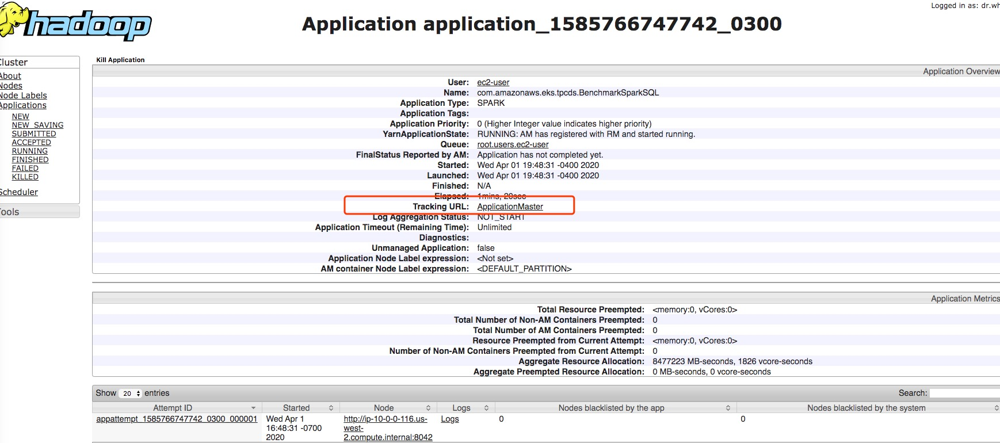

## Benchmark Configuration

### Cluster Spec

|   Spec    |  CDH  |    EKS    |
|-----------|-------|-----------|
|   Master  |  1	  |     N/A   |
|  Executor	|  4	  |     4     |
| Committer	|  S3A  |    S3A    |
|  TPC-DS   |  1T   |     1T    |


| Instance 	  | vCPU 	| Mem (GiB) | Storage  	 | Networking Performance (Gbps)	|
|-----------	|-------|----------	|------------|--------------------------------|
| r4.2xlarge	|  8	  |     61   	|  300GB IO1 |         Up to 10     	        |


### Spark application configurations

```shell
--driver-cores 4
--driver-memory 8G
--executor-cores 2
--executor-memory 8G
--num-executors 10
--conf spark.executor.memoryOverhead=2G
```

```
# Cloud specific
"spark.speculation": "true"
"spark.speculation.multiplier": "3"
"spark.speculation.quantile": "0.9"

# TPCDs Specific
"spark.sql.broadcastTimeout": "7200"
"spark.sql.crossJoin.enabled": "true"
"spark.sql.parquet.mergeSchema": "false"
"spark.sql.parquet.filterPushdown": "true"

# S3 credential
"spark.hadoop.fs.s3a.aws.credentials.provider": "com.amazonaws.auth.InstanceProfileCredentialsProvider"

# S3 Specific config
# We need it to speed up uploads, and outputcommiter/parquet to have consistent writes due to speculation
"spark.hadoop.fs.s3a.connection.timeout": "1200000"
"spark.hadoop.fs.s3a.path.style.access": "true"
"spark.hadoop.fs.s3a.connection.maximum": "200"
"spark.hadoop.fs.s3a.fast.upload": "true"

# S3 Committer
"spark.hadoop.mapreduce.outputcommitter.factory.scheme.s3a": "org.apache.hadoop.fs.s3a.commit.S3ACommitterFactory"
"spark.hadoop.fs.s3a.committer.name": "directory"
"spark.hadoop.fs.s3a.committer.staging.conflict-mode": "append"
```

## EKS

Check [instruction](./benchmark/README.md)

## Cloudera Manager and CDH on EC2 v6.3.2

Following [Getting Started on Amazon Web Services (AWS)](https://docs.cloudera.com/documentation/director/latest/topics/director_get_started_aws.html) to provision your Hadoop Cluster.

Please use following configurations. Beside that, attach IAM Role with `AmazonS3FullAccess` to instances, S3A will need it.

Create Instance Template for Spark executors.



Select Services to providion.



Once you get everything ready, login to the master nodes,

Create user `ec2-user` to submit Spark jobs.

```
$ sudo -u hdfs hadoop fs -mkdir /user/ec2-user
$ sudo -u hdfs hadoop fs -chown ec2-user /user/ec2-user
```

Submit your benchmark sql.

```shell
spark-submit --deploy-mode cluster \
--driver-cores 4 \
--driver-memory 8G \
--executor-cores 2 \
--executor-memory 8G \
--num-executors 10 \
--conf spark.executor.memoryOverhead=2G \
--conf spark.dynamicAllocation.enabled=false \
--conf spark.speculation=false \
--conf spark.speculation.multiplier=3 \
--conf spark.speculation.quantile=0.9 \
--conf spark.sql.broadcastTimeout=7200 \
--conf spark.sql.crossJoin.enabled=true \
--conf spark.sql.parquet.mergeSchema=false \
--conf spark.sql.parquet.filterPushdown=true \
--conf spark.hadoop.fs.s3a.connection.timeout=1200000 \
--conf spark.hadoop.fs.s3a.path.style.access=true \
--conf spark.hadoop.fs.s3a.connection.maximum=200 \
--conf spark.hadoop.fs.s3a.fast.upload=true \
--conf spark.hadoop.mapreduce.outputcommitter.factory.scheme.s3a=org.apache.hadoop.fs.s3a.commit.S3ACommitterFactory \
--conf spark.hadoop.fs.s3a.committer.name=directory \
--conf spark.hadoop.fs.s3a.committer.staging.conflict-mode=append \
--class com.amazonaws.eks.tpcds.BenchmarkSparkSQL s3a://spark-k8s-data/libs/eks-spark-examples-assembly-1.0.jar s3a://spark-k8s-data/TPCDS-TEST-1T s3a://spark-k8s-data/BENCHMARK-RESULT /opt/tpcds-kit/tools 1000 10 false q70-v2.4,q82-v2.4,q64-v2.4
```

> Note: Since Kubernetes doesn't support `spark.dynamicAllocation.enabled` in v2.4.5, we disabled it for Yarn based Spark applications as well by explicitly setting `spark.dynamicAllocation.enabled=false`. This gives us the controler on number of executors.

### Monitor jobs








### Spark Measture metrics

The following results come from [Spark Measture](https://github.com/LucaCanali/sparkMeasure) which is a tool for performance troubleshooting of Apache Spark workloads and simplify the collection and analysis of Spark workload metrics data.

| Metrics | Kubernetes | Yarn |
|-----------	|---------------------	|----------	|
| numStages | 461 | 461 |
| sum(numTasks) | 86860 | 86860 |
| elapsedTime | 10789743 (3.0 h) | 11179917 (3.1 h) |
| sum(stageDuration) | 28187853 (7.8 h) |  30013674 (8.3 h) |
| sum(executorRunTime) | 191530056 (53.2 h) | 215178276 (59.8 h) |
| sum(executorCpuTime) | 154363405 (42.9 h) | 174322200 (48.4 h) |
| sum(executorDeserializeTime) | 416215 (6.9 min) | 402932 (6.7 min) |
| sum(executorDeserializeCpuTime) | 257488 (4.3 min) | 293902 (4.9 min) |
| sum(resultSerializationTime) | 2865 (3 s) | 4371 (4 s) |
| sum(jvmGCTime) | 2542312 (42 min) | 4777682 (1.3 h) |
| sum(shuffleFetchWaitTime) | 4981217 (1.4 h) | 2858238 (48 min) |
| sum(shuffleWriteTime) | 14856523 (4.1 h) | 10641603 (3.0 h) |
| max(resultSize) | 12785180 (12.0 MB) | 12785825 (12.0 MB) |
| sum(numUpdatedBlockStatuses) | 0 | 0 |
| sum(diskBytesSpilled) | 0 (0 Bytes) | 0 (0 Bytes) |
| sum(memoryBytesSpilled) | 0 (0 Bytes) | 0 (0 Bytes) |
| max(peakExecutionMemory) | 429496729600 | 429496729600 |
| sum(recordsRead) | 127932123167 | 127932123167 |
| sum(bytesRead) | 895574425081 (834.0 GB) | 895577095967 (834.0 GB) |
| sum(recordsWritten) | 13 | 13 |
| sum(bytesWritten) | 1875712 (1831.0 KB) | 1913133 (1868.0 KB) |
| sum(shuffleTotalBytesRead) | 1927757194888 (1795.0 GB) | 1927539405616 (1795.0 GB) |
| sum(shuffleTotalBlocksFetched) | 9080641 | 9077546 |
| sum(shuffleLocalBlocksFetched) | 1942150 | 1161946 |
| sum(shuffleRemoteBlocksFetched) | 7138491 | 7915600 |
| sum(shuffleBytesWritten) | 1903885496455 (1773.0 GB) | 1903885565984 (1773.0 GB) |
| sum(shuffleRecordsWritten) | 64737946302 | 64737946302 |